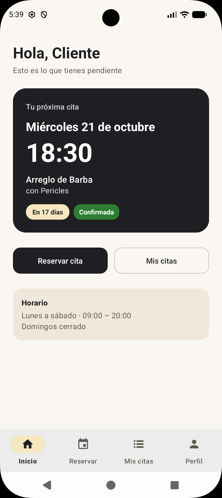
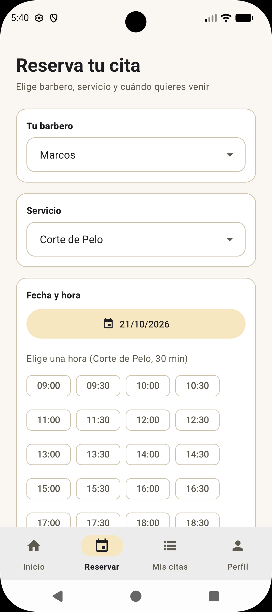
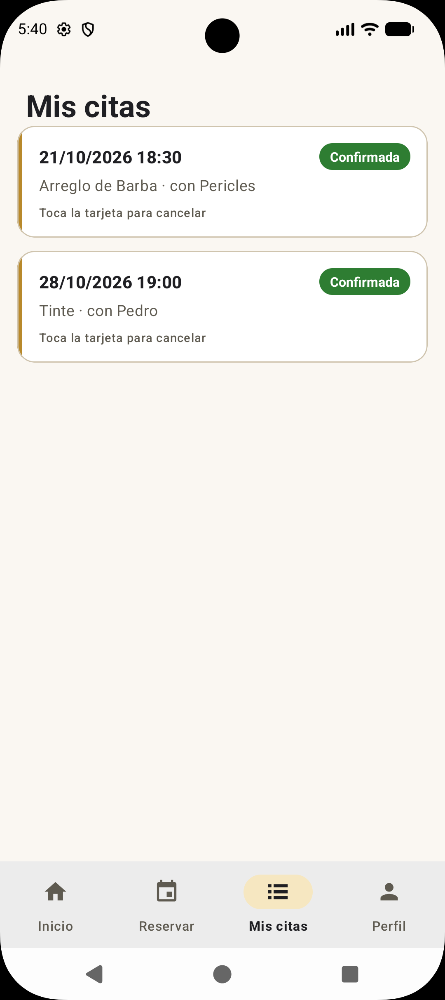
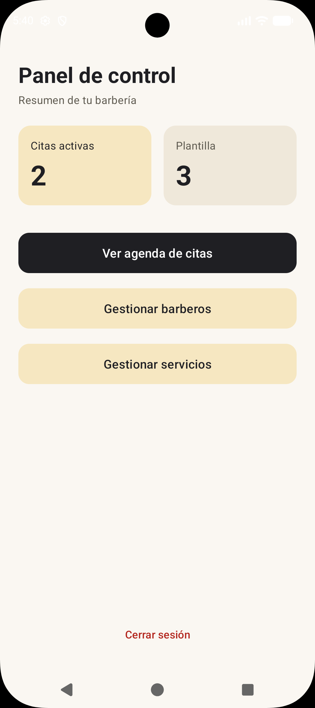

<p align="center">
  
</p>

<h1 align="center">BarberFlow · App Android</h1>

<p align="center">
  Aplicación nativa para reservar citas en una barbería y gestionarla desde un panel de administrador.
</p>

<p align="center">
  
  
  
  <a href="https://github.com/Jcgarval/BarberFlow"></a>
  <a href="https://github.com/Jcgarval/BarberFlow-Android/actions/workflows/tests.yml"></a>
</p>

## Descripción

Cliente móvil del ecosistema **BarberFlow**. Se comunica por REST con un backend en FastAPI ([repositorio del backend](https://github.com/Jcgarval/BarberFlow)) y ofrece dos experiencias según el rol del usuario: **cliente** y **administrador**.

## Funcionalidades

### Cliente
- **Inicio:** saludo personalizado y tarjeta con la **próxima cita** (día, hora, servicio, barbero y cuánto falta), con accesos rápidos para reservar o ver el historial.
- **Reservar:** eliges barbero, servicio y día, y la app muestra como botones las **horas libres** calculadas por el servidor según la duración del servicio y las citas ya reservadas.
- **Mis citas:** historial con el estado de cada cita (pendiente, confirmada, completada o cancelada). Las citas próximas aparecen primero y se pueden cancelar con confirmación.
- **Perfil:** datos de la cuenta y cierre de sesión.

### Administrador
- **Panel de control** con el resumen de citas activas y plantilla.
- **Agenda:** todas las citas ordenadas por fecha; se puede cambiar su estado o eliminarlas.
- **Gestión de barberos y servicios:** altas, ediciones y bajas con diálogos y validación en el propio formulario. Si un barbero o servicio tiene citas, se **da de baja en lugar de borrarse** (se conserva el historial) y se puede **reactivar** desde la opción "Bajas".

## Capturas


<p align="center">
  
  
  
  
</p>


## Arquitectura

```
app/src/main/java/com/example/barberflow/
├── adapters/   # Adaptadores de RecyclerView (citas, agenda, barberos, servicios)
├── api/        # RetrofitClient, AuthInterceptor y definición de endpoints (BarberiaApi)
├── models/     # DTOs, estados de cita y utilidades de formato
└── ui/         # Splash, login, registro, panel de administrador y gestión;
                # MainActivity con navegación inferior y fragments (Inicio, Reservar, Mis citas, Perfil)
```

### Decisiones técnicas
- **Una sola actividad principal con navegación inferior** y fragments que se muestran u ocultan, para conservar el estado de cada sección al cambiar de pestaña.
- **Sesión con JWT:** el token se guarda en `SharedPreferences` y un interceptor de OkHttp lo añade a cada petición.
- **Sesión caducada:** ese mismo interceptor detecta las respuestas 401, cierra la sesión y devuelve al usuario al login con un aviso, sin tener que comprobarlo en cada pantalla.
- **Horas libres calculadas en el servidor**, de modo que la app nunca ofrece huecos ocupados y las reglas (horarios, solapes, días de cierre) viven en un único sitio, cubiertas por las pruebas automáticas del backend.
- **Peticiones asíncronas con corrutinas** (`lifecycleScope`), cancelando la consulta anterior cuando el usuario cambia de opción.
- **Material 3 con tema claro y oscuro**, colores definidos en el tema (nada de colores fijos en los layouts).
- **Textos en `strings.xml`**, listos para traducir.
- **Compatible con Android 7 (minSdk 24):** formateo de fechas sin `java.time`.

## Tecnologías

- Kotlin y Android Studio
- Retrofit 2 + Gson + OkHttp
- Corrutinas de Kotlin
- Material Components (Material 3), RecyclerView y Fragments
- SharedPreferences
- JUnit 4 para las pruebas unitarias
- GitHub Actions para la integración continua

## Cómo ejecutarlo

1. **Arranca el backend** siguiendo las instrucciones del [repositorio BarberFlow](https://github.com/Jcgarval/BarberFlow).
2. Clona este repositorio y ábrelo con Android Studio:

   ```bash
   git clone https://github.com/Jcgarval/BarberFlow-Android.git
   ```

3. Edita la dirección del servidor en `app/src/main/java/com/example/barberflow/api/RetrofitClient.kt`:

   ```kotlin
   private const val BASE_URL = "http://10.0.2.2:8000/"   // emulador de Android Studio
   // private const val BASE_URL = "http://192.168.1.XX:8000/"   // móvil físico: la IP de tu equipo en la red local
   ```

   Si usas un móvil físico, el servidor debe escuchar en toda la red (`uvicorn main:app --host 0.0.0.0`) y ambos dispositivos deben estar en la misma red.
4. Sincroniza Gradle y ejecuta la app.
5. Para entrar como administrador, crea uno con el script `crear_admin.py` del backend.

> En desarrollo la app usa HTTP (`usesCleartextTraffic`). En un entorno real debería usarse HTTPS.

## Pruebas

Las utilidades de formato (fechas, precios) y las reglas de las citas (estados, próxima cita, cancelación) tienen pruebas unitarias que se ejecutan en el ordenador, sin emulador:

```bash
./gradlew test        # en Windows: gradlew.bat test
```

También desde Android Studio: clic derecho sobre `app/src/test` y **Run Tests**.

Cada `push` y cada pull request ejecutan las pruebas unitarias y comprueban que la app compila mediante GitHub Actions (`.github/workflows/tests.yml`).

## Próximas mejoras

- Recordatorios de cita con notificaciones.
- Pruebas automáticas de interfaz.

## Autor

**José Carlos** · [@Jcgarval](https://github.com/Jcgarval)
